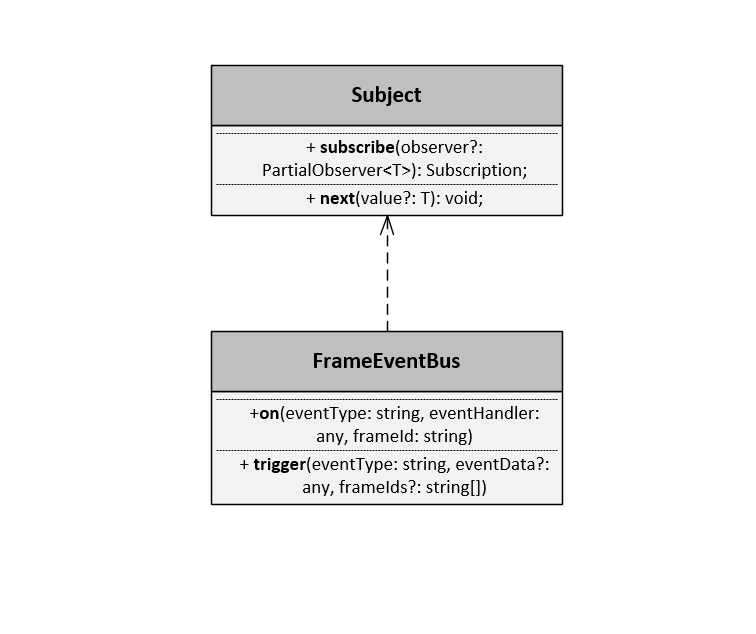

# 简介
在markdown格式文本中嵌入图片是一个比较麻烦的事情，这主要是因为markdown中不支持直接将图片放入其中。所以，如果需要在markdown中使用图片，可根据图片的存储位置，将其分为两种方式:  
- (1) 图片URL;  
- (2) 图片base64转码
## 图片URL
markdown支持使用如下语法的形式引用一个外部图片:  
`

`  
或 使用html的img标签：  
`

`  
注意，这里的url既可以是某一网址，也可以是基于当前文件所在位置的相对路径。实例如下：  
`

`  

## 图片base64转码
如果在局域网环境下，图片URL方式使用受限。markdown支持html语法，所以可以在存储并使用需要展示图片的base64编码，更多相关信息可参考[将图片内嵌入Markdown文档中](https://blog.csdn.net/u010158659/article/details/61197893)一文。

## 使用七牛云作为图床
使用图片URL向markdown中嵌入图片时，既可以使用本地URL，也可以使用在线URL。如果编写的markdown文档为在线文档，则只能使用在线URL。由于外部图床存在各种各样的问题（如地址失效），搭建一个自己的图床很有必要。可以参考[使用七牛云作为图床获取外链方式总结](https://juejin.im/post/5a71ac325188257350518a23)一文，基于七牛云搭建自己的图床服务器，并使用图床服务。

