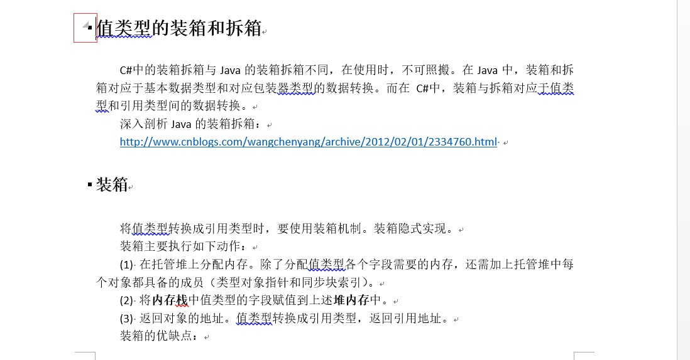

# 简介
在使用Markdown进行文本编辑时，如果文本长度过长，则希望提供折叠功能。这就如在阅读代码时，总会使用到代码阅读工具（如VS Code、VS、Eclipse、MyEclipse、SourceInsight等）的**代码折叠**与**代码展开**功能。期望效果如下图所示：  

目前，Markdown并不支持该功能。如果需要实现文本折叠，还需借助html5 的details标签实现文件折叠。  
另一方面，随着文本内容长度的增加，也可尝试通过提供目录的方法，方便读者快速了解当前文本主要内容。  
# 使用示例
markdown使用html5 的details标签和summary标签可以实现文本折叠，语法如下:  
``` html
<details>
<summary>Title</summary>
<h3>LocalTitle</h3>
<div>Content</div>
</details>
``` 
实际效果如下：
<details>
<summary>Title</summary>
<h3>LocalTitle</h3>
<div>Content</div>
</details>

# 注意
尽管Markdown可以嵌入html标签，但是不建议引入过多的html标签到markdown中，除非现有markdown语法不支持期望的功能。
